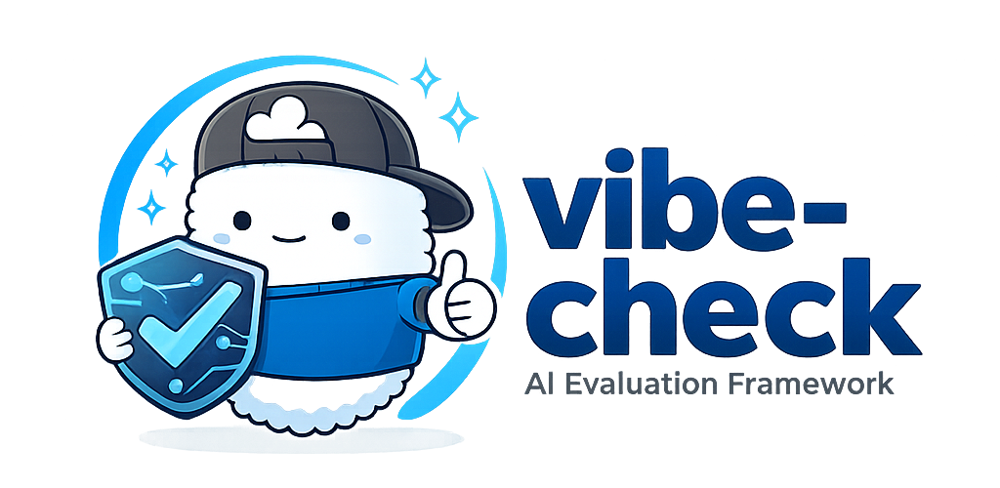

<p align="center">
  
</p>

<h1 align="center">@poofnew/vibe-check</h1>

<p align="center">
  <a href="https://www.npmjs.com/package/@poofnew/vibe-check"></a>
  <a href="https://github.com/poofdotnew/vibe-check/blob/main/LICENSE"></a>
  <a href="https://www.npmjs.com/package/@poofnew/vibe-check"></a>
  <a href="https://github.com/poofdotnew/vibe-check"></a>
</p>

<p align="center">
  A comprehensive AI agent evaluation framework for testing and benchmarking LLM agents.<br/>
  Built with TypeScript and optimized for Bun runtime.
</p>

<p align="center">
  <a href="#features">Features</a> •
  <a href="#installation">Installation</a> •
  <a href="#quick-start">Quick Start</a> •
  <a href="#documentation">Docs</a> •
  <a href="#examples">Examples</a> •
  <a href="https://x.com/poofnew">X</a> •
  <a href="https://t.co/tu734iDt9Q">Discord</a>
</p>

---

## Table of Contents

- [Background](#background)
- [Why vibe-check?](#why-vibe-check)
- [Features](#features)
- [Installation](#installation)
- [Quick Start](#quick-start)
- [Configuration](#configuration)
- [Eval Case Categories](#eval-case-categories)
- [Built-in Judges](#built-in-judges)
- [Custom Judges](#custom-judges)
- [Learning System](#learning-system)
- [CLI Commands](#cli-commands)
- [Programmatic API](#programmatic-api)
- [Examples](#examples)
- [Performance Tips](#performance-tips)
- [Troubleshooting](#troubleshooting)
- [FAQ](#faq)

## Background

Building reliable AI agents is an incredibly challenging endeavor. Unlike
traditional software where inputs and outputs are deterministic, AI agents
operate in a complex, non-deterministic environment where the smallest changes
can have unexpected and far-reaching consequences. A minor prompt modification,
a slight adjustment to system instructions, or even a change in model parameters
can ripple through the entire system, causing subtle failures that are difficult
to detect and diagnose.

Testing AI agents presents unique challenges that traditional testing frameworks
cannot adequately address. How do you validate that an agent correctly
interprets user intent? How do you ensure tool invocations are appropriate and
executed in the right sequence? How do you catch regressions when a prompt
change breaks edge cases you didn't anticipate? These questions become
exponentially more complex when dealing with multi-turn conversations, code
generation, and complex routing decisions.

We built **vibe-check** internally to rigorously test and validate
[poof.new](https://poof.new). As we iterated on prompts, refined agent
behaviors, and added new capabilities, we needed a systematic way to ensure our
changes didn't break existing functionality—and to catch issues before they
reached production. Traditional testing approaches fell short, so we created a
framework specifically designed for AI agent evaluation.

After using vibe-check extensively in our own development process, we're now
open-sourcing it to help the broader AI agent development community. We believe
that robust testing and evaluation frameworks are essential for building
production-ready AI systems, and we hope vibe-check will help others navigate
the complexities of agent development with more confidence.

## Why vibe-check?

Building reliable AI agents is hard. Traditional testing approaches fall short
when evaluating LLM behavior, tool usage, and multi-turn interactions.
**vibe-check** provides a comprehensive framework specifically designed for AI
agent evaluation:

- **Agent-Native Testing**: Evaluate tool calls, code generation, routing
  decisions, and conversational flows
- **Learning from Failures**: Built-in learning system analyzes failures and
  suggests prompt improvements
- **Production-Ready**: Parallel execution, retries, isolated workspaces, and
  detailed reporting
- **Framework Agnostic**: Works with Claude SDK (TypeScript & Python), custom
  agents, or any LLM-powered system
- **Developer-First**: TypeScript-native with full type safety and intuitive
  APIs

### Real-World Use Cases

- **🤖 Agent Development**: Validate your AI agent meets requirements before
  shipping
- **📊 Regression Testing**: Catch regressions when updating prompts or models
- **🔄 A/B Testing**: Compare agent performance across different configurations
- **📈 Continuous Improvement**: Use learning system to systematically improve
  prompts
- **🎯 Benchmarking**: Measure and track agent performance over time
- **🔍 Pre-deployment Validation**: Gate production deployments on eval results

### Comparison

| Feature                   | vibe-check | Manual Testing | Unit Tests |
| ------------------------- | ---------- | -------------- | ---------- |
| Agent-specific evaluation | ✅         | ❌             | ❌         |
| Tool call validation      | ✅         | ⚠️ Difficult   | ❌         |
| Multi-turn conversations  | ✅         | ⚠️ Manual      | ❌         |
| Learning from failures    | ✅         | ❌             | ❌         |
| Isolated workspaces       | ✅         | ❌             | ⚠️ Manual  |
| Parallel execution        | ✅         | ❌             | ✅         |
| Framework agnostic        | ✅         | ✅             | ⚠️ Limited |
| TypeScript-native         | ✅         | N/A            | ✅         |

## Features

- **5 Eval Categories**: Tool usage, code generation, routing, multi-turn
  conversations, and basic evaluations
- **7 Built-in Judges**: File existence, tool invocation, pattern matching,
  syntax validation, skill invocation, and 4 LLM-based judges with rubric
  support
- **Automatic Tool Extraction**: For `claude-code` agents, tool calls are
  automatically extracted from JSONL logs
- **Extensible Judge System**: Create custom judges for specialized validation
- **Parallel Execution**: Run evaluations concurrently with configurable
  concurrency
- **Retry Logic**: Automatic retries with exponential backoff for flaky tests
- **Flaky Test Detection**: Automatically identifies tests that pass on retry
- **Isolated Workspaces**: Each eval runs in its own temporary directory
- **Multi-trial Support**: Run multiple trials per eval with pass thresholds
- **Per-Turn Judges**: Evaluate each turn independently in multi-turn
  conversations
- **Learning System**: Analyze failures and generate improvement rules
- **TypeScript First**: Full type safety with comprehensive type exports

## Installation

```bash
# Using bun (recommended)
bun add @poofnew/vibe-check

# Using npm
npm install @poofnew/vibe-check

# Using pnpm
pnpm add @poofnew/vibe-check
```

## Quick Start

### 1. Initialize your project

```bash
bunx vibe-check init
```

This creates:

- `vibe-check.config.ts` - Configuration file with agent function stub
- `__evals__/example.eval.json` - Example evaluation case

### 2. Configure your agent

Edit `vibe-check.config.ts` to implement your agent function:

```typescript
import { defineConfig } from "@poofnew/vibe-check";

export default defineConfig({
  testDir: "./__evals__",

  agent: async (prompt, context) => {
    // Your agent implementation here
    const result = await yourAgent.run(prompt, {
      cwd: context.workingDirectory,
    });

    return {
      output: result.text,
      success: result.success,
      toolCalls: result.tools,
    };
  },
});
```

### 3. Create eval cases

Create JSON files in `__evals__/` directory:

```json
{
  "id": "create-hello-file",
  "name": "Create Hello File",
  "description": "Test that agent can create a simple file",
  "category": "code-gen",
  "prompt": "Create a file called hello.ts that exports a greet function",
  "targetFiles": ["hello.ts"],
  "expectedPatterns": [
    {
      "file": "hello.ts",
      "patterns": ["export", "function greet"]
    }
  ],
  "judges": ["file-existence", "pattern-match"]
}
```

### 4. Run evaluations

```bash
bunx vibe-check run
```

## Configuration

### Configuration File

Create `vibe-check.config.ts` in your project root:

```typescript
import { defineConfig } from "@poofnew/vibe-check";

export default defineConfig({
  // Required: Your agent function
  agent: async (prompt, context) => {
    return { output: "", success: true };
  },

  // Optional settings with defaults shown
  agentType: "generic", // 'claude-code' | 'generic' - use 'claude-code' for automatic JSONL tool extraction
  testDir: "./__evals__", // Directory containing eval cases
  rubricsDir: "./__evals__/rubrics", // Directory for LLM judge rubrics
  testMatch: ["**/*.eval.json"], // Glob patterns for eval files
  parallel: true, // Run evals in parallel
  maxConcurrency: 3, // Max concurrent evals
  timeout: 300000, // Timeout per eval (ms)
  maxRetries: 2, // Retry failed evals
  retryDelayMs: 1000, // Initial retry delay
  retryBackoffMultiplier: 2, // Exponential backoff multiplier
  trials: 1, // Number of trials per eval
  trialPassThreshold: 0.5, // Required pass rate for trials
  verbose: false, // Verbose output
  preserveWorkspaces: false, // Keep workspace dirs after eval (for debugging)
  outputDir: "./__evals__/results",

  // Custom judges
  judges: [],

  // Workspace hooks (customize workspace creation)
  createWorkspace: async () => {
    return { id: "my-workspace", path: "/path/to/workspace" };
  },
  cleanupWorkspace: async (workspace) => {
    // Custom cleanup logic
  },

  // Lifecycle hooks
  setup: async () => {},
  teardown: async () => {},
  beforeEach: async (evalCase) => {},
  afterEach: async (result) => {},

  // Learning system config
  learning: {
    enabled: false,
    ruleOutputDir: "./prompts",
    minFailuresForPattern: 2,
    autoApprove: false,
  },
});
```

### Agent Function

The agent function receives a prompt and context, and must return an
`AgentResult`:

```typescript
interface AgentContext {
  workingDirectory: string; // Isolated temp directory for this eval
  evalId: string; // Unique eval case ID
  evalName: string; // Eval case name
  sessionId?: string; // For multi-turn sessions
  timeout?: number; // Eval timeout in ms
}

interface AgentResult {
  output: string; // Agent's text output
  success: boolean; // Whether agent completed successfully
  toolCalls?: ToolCall[]; // Record of tool invocations
  sessionId?: string; // Session ID for multi-turn
  error?: Error; // Error if failed
  duration?: number; // Execution time in ms
  usage?: {
    inputTokens: number;
    outputTokens: number;
    totalCostUsd?: number;
  };
}

interface ToolCall {
  toolName: string;
  input: unknown;
  output?: unknown;
  isError?: boolean;
  timestamp?: number; // When the tool was called
  duration?: number; // How long the call took (ms)
}
```

## Eval Case Categories

### Basic (`basic`)

Simple prompt-response evaluations.

```json
{
  "id": "basic-greeting",
  "name": "Basic Greeting",
  "description": "Test basic response",
  "category": "basic",
  "prompt": "Say hello",
  "expectedBehavior": "Should respond with a greeting",
  "judges": []
}
```

### Tool (`tool`)

Validates that specific tools are invoked correctly.

```json
{
  "id": "read-file-test",
  "name": "Read File Test",
  "description": "Test file reading capability",
  "category": "tool",
  "prompt": "Read the contents of package.json",
  "expectedToolCalls": [
    {
      "toolName": "Read",
      "minCalls": 1,
      "maxCalls": 3
    }
  ],
  "judges": ["tool-invocation"]
}
```

### Code Generation (`code-gen`)

Validates file creation and content patterns.

```json
{
  "id": "create-component",
  "name": "Create React Component",
  "description": "Test component generation",
  "category": "code-gen",
  "prompt": "Create a React button component in src/Button.tsx",
  "targetFiles": ["src/Button.tsx"],
  "expectedPatterns": [
    {
      "file": "src/Button.tsx",
      "patterns": [
        "export.*Button",
        "React",
        "onClick"
      ]
    }
  ],
  "syntaxValidation": true,
  "buildVerification": false,
  "judges": ["file-existence", "pattern-match"]
}
```

### Routing (`routing`)

Validates request routing to appropriate agents.

```json
{
  "id": "route-to-coding",
  "name": "Route to Coding Agent",
  "description": "Test routing for code tasks",
  "category": "routing",
  "prompt": "Write a sorting algorithm",
  "expectedAgent": "coding",
  "shouldNotRoute": ["research", "conversational"],
  "judges": []
}
```

### Multi-Turn (`multi-turn`)

Validates multi-turn conversational flows with optional per-turn evaluation.

```json
{
  "id": "iterative-refinement",
  "name": "Iterative Code Refinement",
  "description": "Test multi-turn improvements",
  "category": "multi-turn",
  "turns": [
    {
      "prompt": "Create a basic add function",
      "expectedBehavior": "Creates initial function",
      "judges": ["file-existence"]
    },
    {
      "prompt": "Add input validation",
      "expectedBehavior": "Adds type checking",
      "judges": ["pattern-match"]
    },
    {
      "prompt": "Add JSDoc comments",
      "expectedBehavior": "Documents the function"
    }
  ],
  "judges": ["syntax-validation"],
  "sessionPersistence": true
}
```

### Common Fields

All eval cases support these fields:

| Field         | Type     | Description                                        |
| ------------- | -------- | -------------------------------------------------- |
| `id`          | string   | Unique identifier                                  |
| `name`        | string   | Display name                                       |
| `description` | string   | Description of what's being tested                 |
| `category`    | string   | One of: basic, tool, code-gen, routing, multi-turn |
| `tags`        | string[] | Optional tags for filtering                        |
| `enabled`     | boolean  | Enable/disable (default: true)                     |
| `timeout`     | number   | Override default timeout (ms)                      |
| `trials`      | object   | `{ count: number, passThreshold: number }`         |

## Built-in Judges

### file-existence

Validates that expected files were created.

- Checks all `targetFiles` exist in workspace
- Passes if ≥80% of files exist
- Returns detailed list of missing files

### tool-invocation

Validates tool call counts.

- Checks `expectedToolCalls` against actual calls
- Supports `minCalls` and `maxCalls` constraints
- Defaults `minCalls` to 1 if not specified

### pattern-match

Validates file content matches expected patterns.

- Uses regex patterns from `expectedPatterns`
- Supports multiline matching
- Passes if ≥80% of patterns found

### syntax-validation

Validates generated code has valid syntax.

- Supports TypeScript, JavaScript, JSX, TSX
- Uses Babel parser for accurate syntax checking
- Reports specific syntax errors

### skill-invocation

Validates that specific skills were invoked.

- Checks `expectedSkills` against actual skill calls
- Supports `minCalls` constraints

### LLM Judges (Rubric-based)

Evaluate outputs using LLM with custom rubrics:

- `llm-code-quality` - Evaluate code against code-quality.md rubric
- `llm-response-quality` - Evaluate responses against response-quality.md rubric
- `llm-routing-quality` - Evaluate routing decisions
- `llm-conversation-quality` - Evaluate conversation quality

Configure rubrics directory in your config:

```typescript
export default defineConfig({
  rubricsDir: "./__evals__/rubrics",
  // ...
});
```

Create rubric files (e.g., `code-quality.md`) with evaluation criteria.

### Reference Solutions

Use `referenceSolution` in eval cases for pairwise comparison:

```json
{
  "id": "create-function",
  "category": "code-gen",
  "prompt": "Create an add function",
  "referenceSolution": {
    "description": "A properly typed add function",
    "code": "function add(a: number, b: number): number {\n  return a + b;\n}"
  },
  "judges": ["llm-code-quality"]
}
```

LLM judges will compare the agent's output against the reference solution.

## Custom Judges

Create custom judges by extending `BaseJudge`:

```typescript
import {
  BaseJudge,
  getJudgeRegistry,
  type JudgeContext,
  type JudgeResult,
  type JudgeType,
} from "@poofnew/vibe-check";

class ResponseLengthJudge extends BaseJudge {
  id = "response-length";
  name = "Response Length Judge";
  type: JudgeType = "code";

  constructor(
    private minLength: number = 10,
    private maxLength: number = 1000,
  ) {
    super();
  }

  async evaluate(context: JudgeContext): Promise<JudgeResult> {
    const length = context.executionResult.output.length;

    if (length < this.minLength) {
      return this.createResult({
        passed: false,
        score: 0,
        reasoning: `Response too short: ${length} chars`,
      });
    }

    if (length > this.maxLength) {
      return this.createResult({
        passed: false,
        score: 50,
        reasoning: `Response too long: ${length} chars`,
      });
    }

    return this.createResult({
      passed: true,
      score: 100,
      reasoning: `Response length ${length} is acceptable`,
    });
  }
}

// Register globally
const registry = getJudgeRegistry();
registry.register(new ResponseLengthJudge(20, 500));

// Or add to config
export default defineConfig({
  judges: [new ResponseLengthJudge(20, 500)],
  // ...
});
```

### JudgeContext

```typescript
interface JudgeContext {
  evalCase: EvalCase; // The eval case being judged
  executionResult: ExecutionResult;
  workingDirectory: string; // Workspace path
  turnIndex?: number; // For multi-turn evals
}

interface ExecutionResult {
  success: boolean;
  output: string;
  error?: Error;
  toolCalls: ToolCallRecord[];
  duration: number;
  numTurns?: number;
  sessionId?: string;
  workingDirectory?: string;
  transcript?: Transcript; // Full conversation transcript
  progressUpdates?: ProgressRecord[]; // Progress tracking
  usage?: {
    inputTokens: number;
    outputTokens: number;
    totalCostUsd?: number;
  };
}
```

## Learning System

The learning system automatically analyzes test failures and generates prompt
improvements to enhance your agent's performance over time.

### How It Works

1. **Collect Failures**: Gathers failed evals from test runs or JSONL logs
2. **Generate Explanations**: Uses LLM to analyze why each failure occurred
3. **Detect Patterns**: Groups similar failures into patterns
4. **Propose Rules**: Generates actionable prompt rules to fix systemic issues
5. **Human Review**: Allows manual approval before integrating rules
6. **Iterate**: Re-run evals to validate improvements

### Configuration

Enable learning in your config:

```typescript
export default defineConfig({
  learning: {
    enabled: true,
    ruleOutputDir: "./prompts", // Where to save rules
    minFailuresForPattern: 2, // Min failures to form a pattern
    autoApprove: false, // Require manual review
  },
  // ...
});
```

### Usage

```bash
# Run full learning iteration
vibe-check learn run --source eval

# Analyze failures without generating rules
vibe-check learn analyze --source both

# Review pending rules
vibe-check learn review

# Show learning statistics
vibe-check learn stats

# Auto-approve high-confidence rules (use with caution)
vibe-check learn run --auto-approve
```

### Data Sources

- **eval**: Analyze failures from recent eval runs
- **jsonl**: Load failures from JSONL files
- **both**: Combine both sources

### Output Structure

```
prompts/
├── learned-rules.json          # Approved rules
├── pending-rules.json          # Rules awaiting review
├── history.json                # Learning history
└── iterations/
    └── iteration-{timestamp}.json
```

### Example Rule Output

```json
{
  "ruleId": "rule-1234",
  "ruleContent": "When creating files, always verify the parent directory exists before writing",
  "targetSection": "file-operations",
  "rationale": "Multiple failures showed agents attempting to write to non-existent directories",
  "addressesPatterns": ["pattern-dir-not-found"],
  "expectedImpact": {
    "failureIds": ["eval-123", "eval-456"],
    "confidenceScore": 0.89
  },
  "status": "approved"
}
```

### Best Practices

- Start with `autoApprove: false` to review all rules manually
- Run learning iterations after accumulating 10+ failures
- Set `minFailuresForPattern: 2` to catch recurring issues
- Review rules before integration to avoid over-fitting
- Use JSONL source for production failure logs

## CLI Commands

### vibe-check run

Run the evaluation suite.

```bash
vibe-check run [options]

Options:
  -c, --config <path>        Path to config file
  --category <categories...> Filter by category (tool, code-gen, routing, multi-turn, basic)
  --tag <tags...>            Filter by tag
  --id <ids...>              Filter by eval ID
  -v, --verbose              Verbose output
```

Examples:

```bash
# Run all evals
vibe-check run

# Run only code-gen evals
vibe-check run --category code-gen

# Run evals with specific tags
vibe-check run --tag critical --tag regression

# Run specific evals by ID
vibe-check run --id create-file --id read-file

# Verbose output
vibe-check run -v
```

### vibe-check list

List available eval cases.

```bash
vibe-check list [options]

Options:
  -c, --config <path>        Path to config file
  --category <categories...> Filter by category
  --tag <tags...>            Filter by tag
  --json                     Output as JSON
```

### vibe-check init

Initialize vibe-check in a project.

```bash
vibe-check init [options]

Options:
  --typescript  Create TypeScript config (default)
```

### vibe-check learn

Learning system commands for analyzing failures and generating rules.

```bash
# Run full learning iteration
vibe-check learn run [options]
  --source <source>   Data source (eval, jsonl, both)
  --auto-approve      Auto-approve high-confidence rules
  --save-pending      Save rules for later review

# Analyze failures without generating rules
vibe-check learn analyze [options]
  --source <source>   Data source (eval, jsonl, both)

# Review pending rules
vibe-check learn review

# Show learning statistics
vibe-check learn stats
```

## Programmatic API

Use vibe-check programmatically in your code:

```typescript
import {
  defineConfig,
  EvalRunner,
  loadConfig,
  loadEvalCases,
} from "@poofnew/vibe-check";

// Load and run
const config = await loadConfig("./vibe-check.config.ts");
const runner = new EvalRunner(config);

const result = await runner.run({
  categories: ["code-gen"],
  tags: ["critical"],
});

console.log(`Pass rate: ${result.passRate * 100}%`);
console.log(`Duration: ${result.duration}ms`);

// Access individual results
for (const evalResult of result.results) {
  if (!evalResult.success) {
    console.log(`Failed: ${evalResult.evalCase.name}`);
    for (const judge of evalResult.judgeResults) {
      if (!judge.passed) {
        console.log(`  - ${judge.judgeId}: ${judge.reasoning}`);
      }
    }
  }
}
```

### Exports

```typescript
// Configuration
export { defaultConfig, defineConfig, loadConfig };
export type {
  AgentContext,
  AgentFunction,
  AgentResult,
  ResolvedConfig,
  VibeCheckConfig,
};

// Schemas
export {
  isBasicEval,
  isCodeGenEval,
  isMultiTurnEval,
  isRoutingEval,
  isToolEval,
  parseEvalCase,
};
export type { CodeGenEvalCase, EvalCase, EvalCategory, ToolEvalCase /* ... */ };

// Runner
export { EvalRunner };
export type { EvalSuiteResult, RunnerOptions };

// Judges
export { BaseJudge, getJudgeRegistry, JudgeRegistry, resetJudgeRegistry };
export type { ExecutionResult, Judge, JudgeContext, JudgeResult, JudgeType };

// Harness
export { TestHarness };
export type { EvalWorkspace, HarnessOptions };

// Utils
export { groupByCategory, loadEvalCase, loadEvalCases };

// Adapters (for multi-language support)
export { PythonAgentAdapter } from '@poofnew/vibe-check/adapters';
export type { PythonAdapterOptions, AgentRequest, AgentResponse } from '@poofnew/vibe-check/adapters';
```

## Examples

Explore complete working examples in the [`examples/`](./examples) directory:

### 🎯 [Basic Example](./examples/basic)

Simple agent integration with minimal configuration:

```bash
cd examples/basic
bun install
bun run vibe-check run
```

**Use case**: Quick start template, testing custom agents

### 🤖 [Claude Agent SDK Integration](./examples/claude-agent-sdk)

Full-featured Claude SDK integration with tool tracking (TypeScript):

```bash
cd examples/claude-agent-sdk
bun install
export ANTHROPIC_API_KEY=your_key
bun run vibe-check run
```

**Use case**: Production Claude agents, comprehensive testing

### 🐍 [Python Agent SDK Integration](./examples/python-agent)

Python SDK integration using the process-based adapter:

```bash
cd examples/python-agent
bun install
./setup.sh  # Creates Python venv and installs claude-agent-sdk
export ANTHROPIC_API_KEY=your_key
bun run vibe-check run
```

**Use case**: Python-based Claude agents, multi-language support

The Python adapter uses a JSON protocol over stdin/stdout to communicate with Python agent scripts:

```typescript
import { PythonAgentAdapter } from '@poofnew/vibe-check/adapters';

const adapter = new PythonAgentAdapter({
  scriptPath: './agent.py',
  pythonPath: './.venv/bin/python',
  env: { ANTHROPIC_API_KEY: process.env.ANTHROPIC_API_KEY },
});

export default defineConfig({
  agent: adapter.createAgent(),
  agentType: 'claude-code',
});
```

#### Eval Examples by Category and Judge

| Eval File | Category | Judges Used |
|-----------|----------|-------------|
| basic.eval.json | basic | llm-code-quality |
| code-gen.eval.json | code-gen | file-existence, pattern-match, syntax-validation |
| tool-usage.eval.json | tool | tool-invocation |
| multi-turn.eval.json | multi-turn | - |
| route-to-coding.eval.json | routing | agent-routing |
| route-to-research.eval.json | routing | agent-routing |
| route-to-reviewer.eval.json | routing | agent-routing |
| route-intent-classification.eval.json | tool | tool-invocation |
| tool-chain-explore-modify.eval.json | tool | tool-invocation |
| tool-chain-search-replace.eval.json | tool | tool-invocation |
| tool-chain-bash.eval.json | tool | tool-invocation |
| tool-chain-analysis.eval.json | tool | tool-invocation |
| multi-file-feature.eval.json | code-gen | file-existence, pattern-match, syntax-validation |
| skill-invocation.eval.json | tool | tool-invocation, skill-invocation |
| code-review.eval.json | basic | llm-code-quality |
| debug-workflow.eval.json | code-gen | file-existence, pattern-match, syntax-validation |

### 🎨 [Custom Judges](./examples/custom-judges)

Advanced custom validation logic:

```bash
cd examples/custom-judges
bun install
bun run vibe-check run
```

**Use case**: Domain-specific validation, custom metrics

### 🔄 [Multi-Turn](./examples/multi-turn)

Multi-turn conversation testing with session persistence:

```bash
cd examples/multi-turn
bun install
bun run vibe-check run
```

**Use case**: Conversational agents, iterative refinement flows

### 📚 [Learning System](./examples/learning)

Demonstrates the learning system with a mock agent that has deliberate flaws:

```bash
cd examples/learning
bun install
bun run vibe-check run           # Runs evals (some will fail by design)
bun run vibe-check learn stats   # Shows learning system status
bun run vibe-check learn analyze # Analyzes failures (requires ANTHROPIC_API_KEY)
```

**Use case**: Understanding the learning system, testing failure analysis pipeline

The example includes:
- A mock agent with predictable flaws (uses Read instead of Write, refuses delete operations, etc.)
- Pre-configured eval cases designed to fail
- Pre-generated results so learning commands work immediately

## Performance Tips

Optimize your eval suite for speed and reliability:

### Parallel Execution

```typescript
export default defineConfig({
  parallel: true,
  maxConcurrency: 5, // Balance between speed and resource usage
});
```

**Tip**: Higher concurrency = faster but more memory/API usage. Start with 3-5.

### Selective Test Runs

```bash
# Run only critical tests during development
vibe-check run --tag critical

# Run specific categories
vibe-check run --category tool code-gen

# Run single test for debugging
vibe-check run --id my-test-id
```

### Optimize Timeouts

```typescript
export default defineConfig({
  timeout: 60000,  // Default for all tests
});

// Override per eval case
{
  "id": "quick-test",
  "timeout": 10000,  // Fast tests
  // ...
}

{
  "id": "complex-generation",
  "timeout": 300000,  // Longer timeout for complex tasks
  // ...
}
```

### Retry Strategy

```typescript
export default defineConfig({
  maxRetries: 2, // Retry failed tests
  retryDelayMs: 1000, // Initial delay
  retryBackoffMultiplier: 2, // Exponential backoff
});
```

**Tip**: Enable retries for flaky network/API tests, disable for deterministic
tests.

### Trial Optimization

```typescript
export default defineConfig({
  trials: 3,              // Run each test 3 times
  trialPassThreshold: 0.67,  // Pass if 2/3 succeed
});

// Or per eval
{
  "id": "flaky-test",
  "trials": { "count": 5, "passThreshold": 0.8 },
  // ...
}
```

**Tip**: Use trials for non-deterministic agent behavior, but avoid
over-reliance.

### Workspace Management

By default, vibe-check creates temporary workspaces and cleans them up after
each eval. Use `preserveWorkspaces: true` for debugging:

```typescript
export default defineConfig({
  preserveWorkspaces: true, // Keep workspaces for inspection
  // ...
});
```

### Workspace Hooks

For full control over workspace lifecycle, use `createWorkspace` and
`cleanupWorkspace` hooks:

```typescript
import { defineConfig, type EvalWorkspace } from "@poofnew/vibe-check";
import * as fs from "fs/promises";
import * as path from "path";
import { execFile } from "child_process";
import { promisify } from "util";

const execFileAsync = promisify(execFile);

export default defineConfig({
  createWorkspace: async (): Promise<EvalWorkspace> => {
    const id = `ws-${Date.now()}-${Math.random().toString(36).slice(2)}`;
    const wsPath = path.join(process.cwd(), "__evals__/results/workspaces", id);

    // Copy your template (including node_modules for fast setup)
    await fs.cp("./template", wsPath, { recursive: true });

    // Optional: install dependencies if not included in template
    // await execFileAsync('npm', ['install'], { cwd: wsPath });

    return { id, path: wsPath };
  },

  cleanupWorkspace: async (workspace: EvalWorkspace): Promise<void> => {
    await fs.rm(workspace.path, { recursive: true, force: true });
  },
  // ...
});
```

**Benefits of custom workspace hooks:**

- Use any package manager (npm, yarn, pnpm, bun)
- Pre-install dependencies in template for faster workspace setup
- Custom setup logic per workspace
- Full control over cleanup behavior

## Troubleshooting

### Common Issues

#### "Cannot find config file"

```bash
# Ensure config exists
ls vibe-check.config.ts

# Or specify path
vibe-check run --config ./path/to/config.ts
```

#### "No eval cases found"

```typescript
// Check testDir and testMatch in config
export default defineConfig({
  testDir: "./__evals__", // Must exist
  testMatch: ["**/*.eval.json"], // Must match file names
});
```

```bash
# List all detected evals
vibe-check list
```

#### "Agent timeout exceeded"

```typescript
// Increase timeout
export default defineConfig({
  timeout: 300000,  // 5 minutes
});

// Or per eval
{
  "timeout": 600000  // 10 minutes for slow tests
}
```

#### "Module not found" errors with Claude SDK

```bash
# Install peer dependencies
bun add @anthropic-ai/sdk @anthropic-ai/claude-agent-sdk

# Verify installation
bun pm ls | grep anthropic
```

#### Test failures in CI/CD

```typescript
// Reduce concurrency for stability
export default defineConfig({
  parallel: true,
  maxConcurrency: 2, // Lower for CI environments
  maxRetries: 3, // More retries for flaky CI networks
});
```

#### Out of memory errors

```bash
# Reduce concurrency
vibe-check run --config config-with-lower-concurrency.ts

# Or run tests in batches
vibe-check run --category tool
vibe-check run --category code-gen
```

### Debug Mode

```bash
# Enable verbose output
vibe-check run -v

# Preserve workspaces for inspection
vibe-check run --config config-with-preserve-workspaces.ts
```

### Getting Help

- Check [examples](./examples) for working configurations
- Search [GitHub Issues](https://github.com/poofdotnew/vibe-check/issues)
- Join our [Discord](https://t.co/tu734iDt9Q)
- Post on [X](https://x.com/poofnew)

## FAQ

### General

**Q: What agent frameworks does vibe-check support?**

A: Any agent that can be wrapped in an `async (prompt, context) => AgentResult`
function. Built-in support for Claude SDK (TypeScript and Python via adapters),
but works with LangChain, custom agents, or any LLM framework.

**Q: Can I use this with other LLMs (OpenAI, Gemini, etc.)?**

A: Yes! The framework is LLM-agnostic. Just implement the agent function to call
your preferred LLM.

**Q: Do I need Bun or can I use Node/npm?**

A: While optimized for Bun, vibe-check works with Node.js 18+ and npm/pnpm. Bun
is recommended for best performance.

**Q: Can I use Python agents with vibe-check?**

A: Yes! Use the `PythonAgentAdapter` from `@poofnew/vibe-check/adapters`. It
spawns Python scripts as subprocesses and communicates via JSON over stdin/stdout.
See the [Python Agent SDK Integration](./examples/python-agent) example.

### Configuration

**Q: How do I test multi-file code generation?**

A: Use `code-gen` category with multiple `targetFiles`:

```json
{
  "category": "code-gen",
  "targetFiles": ["src/index.ts", "src/utils.ts", "test/index.test.ts"],
  "expectedPatterns": [...],
  "judges": ["file-existence", "pattern-match"]
}
```

**Q: Can I use custom validation logic?**

A: Yes! Create custom judges extending `BaseJudge`. See
[Custom Judges](#custom-judges).

**Q: How do I handle authentication/secrets in tests?**

A: Use environment variables:

```typescript
export default defineConfig({
  agent: async (prompt, context) => {
    const apiKey = process.env.ANTHROPIC_API_KEY;
    // ...
  },
});
```

### Learning System

**Q: Does the learning system modify my prompts automatically?**

A: No! It generates rule suggestions that require human review (unless
`autoApprove: true`). You control what gets integrated.

**Q: How many failures do I need to generate useful rules?**

A: Start with 10+ failures. The system works best with 20-50 failures showing
clear patterns.

**Q: Can I use production logs for learning?**

A: Yes! Export failures to JSONL format and use `--source jsonl`.

### Performance

**Q: How fast does vibe-check run?**

A: Depends on agent speed and concurrency. With `maxConcurrency: 5` and Claude
SDK, expect ~10-20 evals/minute.

**Q: Can I run tests in CI/CD?**

A: Yes! Use exit codes for CI integration:

```bash
vibe-check run || exit 1  # Fails CI if tests fail
```

**Q: How do I speed up slow test suites?**

A: See [Performance Tips](#performance-tips). Key strategies: increase
concurrency, use selective runs, optimize timeouts.

### Debugging

**Q: Where are test artifacts stored?**

A: By default in `__evals__/results/`. Workspaces are temporary unless
`preserveWorkspaces: true`.

**Q: How do I debug a single failing test?**

A: Run with verbose mode and workspace preservation:

```bash
vibe-check run --id failing-test -v
```

Set `preserveWorkspaces: true` to inspect the working directory.

**Q: Why are my tests flaky?**

A: LLMs are non-deterministic. Use trials with pass thresholds:

```typescript
{ trials: 3, trialPassThreshold: 0.67 }
```

## Development

### Prerequisites

- [Bun](https://bun.sh) >= 1.0

### Setup

```bash
# Clone the repository
git clone https://github.com/poofdotnew/vibe-check.git
cd vibe-check

# Install dependencies
bun install

# Run tests
bun test

# Build
bun run build

# Type check
bun run typecheck
```

### Project Structure

```
src/
├── bin/                  # CLI entry points
│   ├── vibe-check.ts      # Main executable
│   └── cli.ts            # CLI commands
├── config/               # Configuration
│   ├── types.ts          # Type definitions
│   ├── schemas.ts        # Zod validation schemas
│   └── config-loader.ts  # Config file loading
├── harness/              # Test execution
│   ├── test-harness.ts   # Main execution engine
│   └── workspace-manager.ts
├── judges/               # Evaluation judges
│   ├── judge-interface.ts
│   ├── judge-registry.ts
│   └── builtin/          # Built-in judges
├── runner/               # Test orchestration
│   └── eval-runner.ts
├── learning/             # Learning system
└── utils/                # Utilities
```

## CI/CD Integration

### GitHub Actions

```yaml
name: Eval Tests

on: [push, pull_request]

jobs:
  test:
    runs-on: ubuntu-latest
    steps:
      - uses: actions/checkout@v4

      - uses: oven-sh/setup-bun@v1
        with:
          bun-version: latest

      - name: Install dependencies
        run: bun install

      - name: Run vibe-check
        env:
          ANTHROPIC_API_KEY: ${{ secrets.ANTHROPIC_API_KEY }}
        run: bun run vibe-check run
```

### GitLab CI

```yaml
test:
  image: oven/bun:latest
  script:
    - bun install
    - bun run vibe-check run
  variables:
    ANTHROPIC_API_KEY: $ANTHROPIC_API_KEY
```

### CircleCI

```yaml
version: 2.1

jobs:
  test:
    docker:
      - image: oven/bun:latest
    steps:
      - checkout
      - run: bun install
      - run: bun run vibe-check run
```

### Tips for CI

- Use `maxConcurrency: 2-3` for stable CI runs
- Set appropriate timeouts for CI environment
- Cache dependencies for faster runs
- Store API keys in secrets/environment variables
- Consider running critical tests only on PRs, full suite on main
